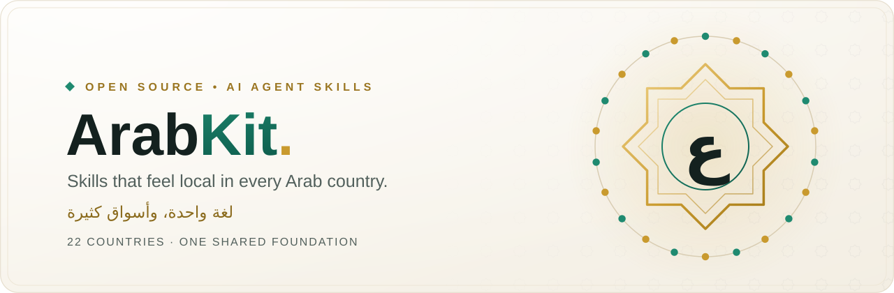

<div align="center">

<picture>
  <source media="(prefers-color-scheme: dark)" srcset="assets/arabkit-hero-dark.svg">
  
</picture>

<p>
  <a href="LICENSE"></a>
  <a href="#countries"></a>
  <a href="#countries"></a>
  <a href="CONTRIBUTING.md"></a>
  <a href="https://github.com/asasemahmed/arabkit/actions/workflows/validate.yml"></a>
</p>

**[Countries](#countries)** · **[How it works](#how-it-works)** · **[Contribute](#claim-your-country)** · **[Roadmap](https://github.com/asasemahmed/arabkit/issues/16)** · **[Discussions](https://github.com/asasemahmed/arabkit/discussions)** · **[اقرأ بالعربية](README.ar.md)**

</div>

---

> **Arabic is one language with many markets.** A checkout that feels natural in Cairo can feel foreign in Riyadh or Casablanca. ArabKit gives AI coding agents the local knowledge to get each one right.

ArabKit is an open-source library of AI agent skills, organized **by country**. Every Arab country has its own folder, written and reviewed by people who live there and build for its users. Guidance that holds everywhere, like Arabic typography and RTL layout, lives in one shared folder.

It works with Claude Code, Codex, Cursor, Gemini CLI, and any agent that loads `SKILL.md` files.

> [!NOTE]
> **ArabKit is just getting started.** The first skills are in: four shared Arabic foundations and `egypt-copy` as the first country skill. The other 21 country folders are open, and their first contributors decide how each one is done. [Claim your country.](#claim-your-country)

## Why country by country?

The same screen needs different answers depending on where its users are:

| | 🇪🇬 Egypt | 🇸🇦 Saudi Arabia | 🇦🇪 UAE | 🇲🇦 Morocco |
|---|---|---|---|---|
| Phone | `+20` | `+966` | `+971` | `+212` |
| Currency | `EGP` | `SAR` | `AED` | `MAD` |
| Weekend | Fri–Sat | Fri–Sat | Sat–Sun | Sat–Sun |
| Everyday dialect | Egyptian | Najdi, Hejazi, Gulf | Emirati, Gulf | Darija |
| Second language in products | English | English | English | French |

An agent that only knows "Arabic" will guess at every row. Country skills replace the guesses with what local builders actually know: which register to write in, how addresses and phone numbers are entered, which payment methods people expect, and what makes a product trustworthy.

## Countries

Each folder has a README with the country's codes, skill prefix, and ideas for first skills.

<!-- countries:start -->

### Arabian Peninsula

| | Country | الدولة | Prefix | Skills |
|---|---|---|---|---|
| 🇧🇭 | [Bahrain](countries/bahrain/README.md) | البحرين | `bahrain-` | Open for contributors |
| 🇰🇼 | [Kuwait](countries/kuwait/README.md) | الكويت | `kuwait-` | Open for contributors |
| 🇴🇲 | [Oman](countries/oman/README.md) | عُمان | `oman-` | Open for contributors |
| 🇶🇦 | [Qatar](countries/qatar/README.md) | قطر | `qatar-` | Open for contributors |
| 🇸🇦 | [Saudi Arabia](countries/saudi-arabia/README.md) | السعودية | `saudi-` | Open for contributors |
| 🇦🇪 | [United Arab Emirates](countries/uae/README.md) | الإمارات | `uae-` | Open for contributors |
| 🇾🇪 | [Yemen](countries/yemen/README.md) | اليمن | `yemen-` | Open for contributors |

### Levant and Iraq

| | Country | الدولة | Prefix | Skills |
|---|---|---|---|---|
| 🇮🇶 | [Iraq](countries/iraq/README.md) | العراق | `iraq-` | Open for contributors |
| 🇯🇴 | [Jordan](countries/jordan/README.md) | الأردن | `jordan-` | Open for contributors |
| 🇱🇧 | [Lebanon](countries/lebanon/README.md) | لبنان | `lebanon-` | Open for contributors |
| 🇵🇸 | [Palestine](countries/palestine/README.md) | فلسطين | `palestine-` | Open for contributors |
| 🇸🇾 | [Syria](countries/syria/README.md) | سوريا | `syria-` | Open for contributors |

### Nile Valley

| | Country | الدولة | Prefix | Skills |
|---|---|---|---|---|
| 🇪🇬 | [Egypt](countries/egypt/README.md) | مصر | `egypt-` | [`egypt-copy`](countries/egypt/skills/egypt-copy/SKILL.md) |
| 🇸🇩 | [Sudan](countries/sudan/README.md) | السودان | `sudan-` | Open for contributors |

### Maghreb

| | Country | الدولة | Prefix | Skills |
|---|---|---|---|---|
| 🇩🇿 | [Algeria](countries/algeria/README.md) | الجزائر | `algeria-` | Open for contributors |
| 🇱🇾 | [Libya](countries/libya/README.md) | ليبيا | `libya-` | Open for contributors |
| 🇲🇷 | [Mauritania](countries/mauritania/README.md) | موريتانيا | `mauritania-` | Open for contributors |
| 🇲🇦 | [Morocco](countries/morocco/README.md) | المغرب | `morocco-` | Open for contributors |
| 🇹🇳 | [Tunisia](countries/tunisia/README.md) | تونس | `tunisia-` | Open for contributors |

### Horn of Africa and Indian Ocean

| | Country | الدولة | Prefix | Skills |
|---|---|---|---|---|
| 🇰🇲 | [Comoros](countries/comoros/README.md) | جزر القمر | `comoros-` | Open for contributors |
| 🇩🇯 | [Djibouti](countries/djibouti/README.md) | جيبوتي | `djibouti-` | Open for contributors |
| 🇸🇴 | [Somalia](countries/somalia/README.md) | الصومال | `somalia-` | Open for contributors |

### All countries (shared)

| | Folder | Prefix | Skills |
|---|---|---|---|
| 🌍 | [`shared/`](shared/README.md) | `arabic-` | [`arabic-copy`](shared/skills/arabic-copy/SKILL.md) [`arabic-rtl`](shared/skills/arabic-rtl/SKILL.md) [`arabic-search`](shared/skills/arabic-search/SKILL.md) [`arabic-ui`](shared/skills/arabic-ui/SKILL.md) |

<!-- countries:end -->

## How it works

```text
arabkit/
├── countries/
│   ├── egypt/
│   │   ├── README.md
│   │   └── skills/
│   │       └── egypt-copy/
│   │           ├── SKILL.md          ← when to use it + the guidance
│   │           └── references/       ← long tables and datasets
│   ├── saudi-arabia/
│   └── … 22 countries
├── shared/                            ← arabic-* skills for every country
├── templates/SKILL.template.md        ← start here
└── countries.json                     ← folders, prefixes, country data
```

- **A skill is a folder with a `SKILL.md`.** Its frontmatter tells the agent when to load it; the body is plain Markdown guidance.
- **Every name starts with its country's prefix,** such as `saudi-copy` or `morocco-product-ux`, so skills from different countries never collide when installed together.
- **Country first, shared second.** If a rule depends on a dialect, currency, phone format, payment method, or law, it belongs in a country folder. Only what is true everywhere goes in `shared/`.

## Install skills

Install with the [skills CLI](https://www.skills.sh). It asks which skills and which agents to install for:

```bash
npx skills add asasemahmed/arabkit
```

Or pick skills directly. For example, the shared foundations plus Egyptian copy:

```bash
npx skills add asasemahmed/arabkit --skill arabic-ui --skill arabic-rtl --skill arabic-copy --skill egypt-copy
```

Pick only the countries you build for. Country skills and shared skills are designed to load together.

## Claim your country

The best contributors are people who build products for their own country.

1. **Open your country's folder** under [`countries/`](countries).
2. **Copy the template** from [`templates/SKILL.template.md`](templates/SKILL.template.md). A `<prefix>-copy` or `<prefix>-product-ux` skill is a great first one.
3. **Validate and open a pull request:**

   ```bash
   python scripts/build_readme.py
   python scripts/validate.py
   ```

Want to own a country long-term? [Volunteer as a country maintainer](https://github.com/asasemahmed/arabkit/issues/new?template=country-maintainer.yml). Have an idea but no time to write it? [Propose a skill](https://github.com/asasemahmed/arabkit/issues/new?template=new-skill.yml).

Looking for something smaller? Pick a [good first issue](https://github.com/asasemahmed/arabkit/issues?q=is%3Aissue+is%3Aopen+label%3A%22good+first+issue%22), follow the pinned [roadmap](https://github.com/asasemahmed/arabkit/issues/16), or [introduce yourself](https://github.com/asasemahmed/arabkit/discussions/17) in Discussions.

The full guide is in [CONTRIBUTING.md](CONTRIBUTING.md).

## Principles

1. **Local, not stereotyped.** Write for how people really read, pay, and trust, without caricature or forced slang.
2. **Dialect is a decision.** Every skill says when the local dialect fits and when Modern Standard Arabic is better.
3. **Facts have dates.** Providers, fees, laws, and number ranges change, so they are marked and reviewed.
4. **Specific over generic.** Agents already know general engineering. Skills add what only local builders know.
5. **Composable.** Country skills and shared skills load together without overlapping.

## Related

[**MasrKit**](https://github.com/asasemahmed/MasrKit) is a complete skill set for Egypt, covering copy, product UX, RTL, backend, and audits. It is the model for the depth ArabKit aims for in every country.

## License

ArabKit is open source under the [MIT License](LICENSE).

<div align="center">

**ArabKit · لغة واحدة، وأسواق كثيرة**

</div>
